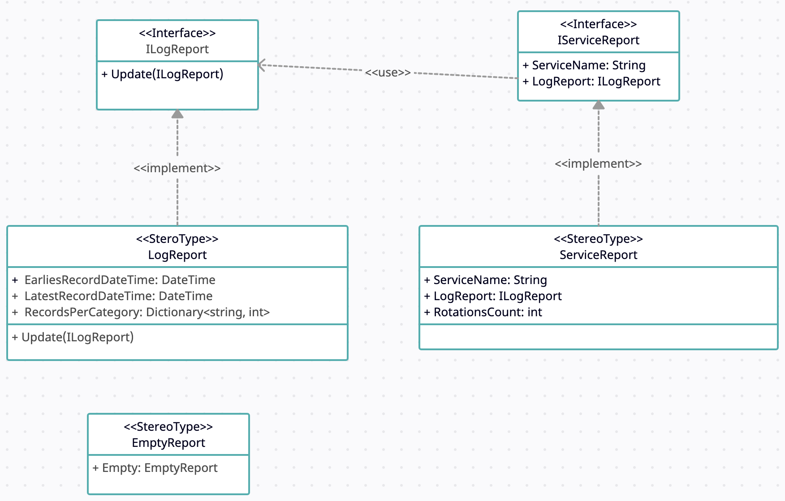
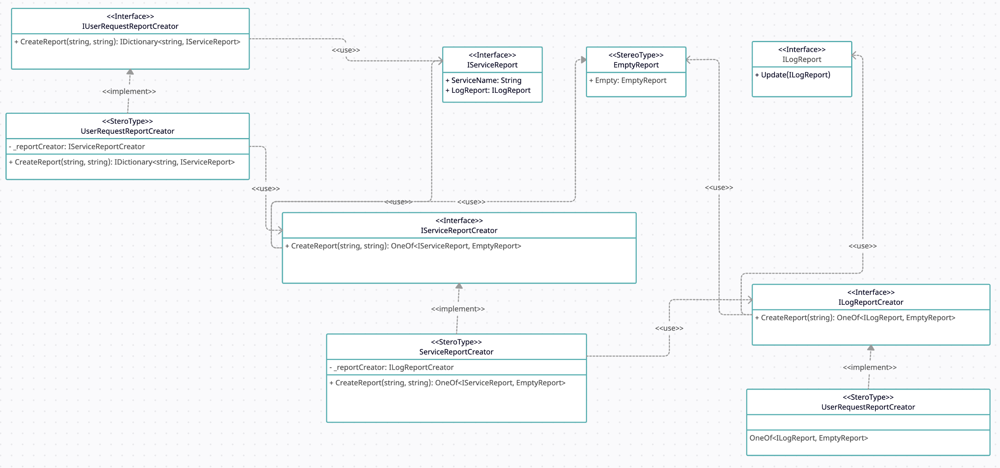

# LogReport
#### Автор: Андраш Тот

Для достижения гибкости программы при сборе информации из логов отчеты представлены
следующими классами и интерфейсами:
- `ILogReport` - Базовый интерфейс для представления отчета о конктретном логе
- `IServiceReport` - Базовый интерфейс для представления отчета о конктретном сервисе
- `LogReport` - Класс, хранящий информацию, которую необходимо собирать из логов по условию задачи
- `ServiceReport` - Класс, являющийся отчетом о конкретном сервисе, хранит данные, которые необходимо собрать о сервисе
по условию задачи
- `EmptyReport` - Класс, представляющий пустой отчет (для нестандартных и аварийных ситуаций)

На схеме ниже представлены вышеописанные сущности и их связи:

Сбор информации для отчетов и их формирование представлено следующими классами и интерфейсами:
- `ILogReportCreator` - Базовый интерфейс для представления класса, формирующего отчет об одном логе
- `IServiceReportCreator` - Базовый интерфейс для представления класса, формирующего отчет об одном сервисе
- `IUserRequestReportCreator` - Базовый интерфейс для представления класса, формирующего отчет на запрос пользователя
- `LogReportCreator` - Класс, формирующий отчет о логе по условию задания
- `ServiceReportCreator` - Класс, формирующий отчет о сервисе по условию задания
- `UserRequestReportCreator` - Класс, формирующий отчет на запрос пользователя по условию задания

Дополнительно для анонимизации персональных данных используется класс `EmailAnonymizerService`.

Дополнительно используется пакет  [OneOf](https://github.com/mcintyre321/OneOf).
